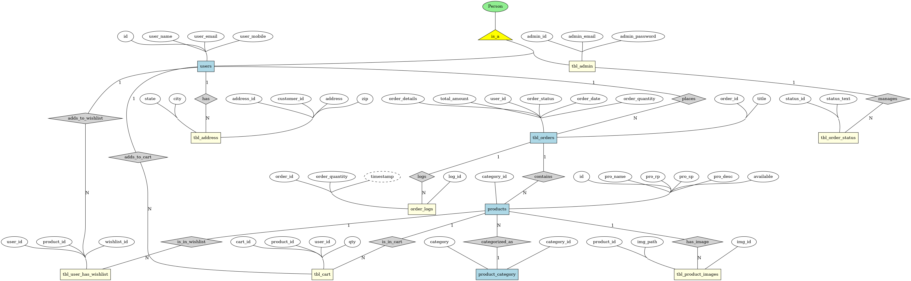

# FindYourFind E-commerce Platform

An inventory management and e-commerce platform created as a web-based application. Built with HTML, CSS, JavaScript, PHP, and MySQL, this project offers an interactive shopping experience with essential features for both customers and admins.

## Table of Contents

1. [Introduction](#introduction)
2. [Features](#features)
3. [Technologies Used](#technologies-used)
4. [Database Schema](#database-schema)
5. [Implementation Details](#implementation-details)
6. [Setup Instructions](#setup-instructions)
7. [Future Scope](#future-scope)

## Introduction

FindYourFind is an e-commerce platform focused on inventory management and order processing with role-based access for **customers** and **admins**. Admins can manage products and view all orders, while customers can explore products, add items to their cart or wishlist, place orders, and view order history.

### Purpose

The system provides an efficient way to manage e-commerce operations with features like order logging and real-time inventory updates, demonstrating the integration of a structured database with a dynamic front end.

## Features

- **User Role (Customer):**
  - Browse products, view details, and manage items in the cart or wishlist.
  - Place orders with quantity selection and view order history.

- **Admin Role:**
  - Manage inventory by adding, updating, or deleting products.
  - View all customer orders and oversee order management.

- **Database Automation:**
  - Stored procedures for efficient data retrieval.
  - Triggers for real-time order logging in the database.

## Technologies Used

- **Frontend**: HTML, CSS, JavaScript for the user interface.
- **Backend**: PHP to handle server requests and data processing.
- **Database**: MySQL with tables for products, categories, orders, users, and logs, including triggers and stored procedures.

## Database Schema

Key tables include:
- **Products**: Stores product details.
- **Categories**: Manages product categories.
- **Cart**: Tracks items in each user’s cart.
- **Orders**: Stores order information with a trigger to log orders.
- **Order Logs**: Automatically records new orders.
- **Wishlist**: Manages items added to the wishlist.

Refer to the project’s ER diagram for detailed relationships.

### ER Diagram

## Database Setup

A sample database file is provided to set up the project database. You can find it in the [`database/findyourfind.sql`](database/findyourfind.sql) file. Import this file into your MySQL database to create the necessary tables and relationships.

## Implementation Details

- **Role-Based Access**: PHP scripts enforce role-specific access, ensuring that customers and admins only access permitted functionalities.
- **Stored Procedures**: A procedure to retrieve product details and total orders.
- **Triggers**: An order log trigger records order details for auditing and tracking.

## Setup Instructions

1. Clone the repository.
2. Set up the MySQL database by importing the `findyourfind.sql` file located in the `database` folder.
3. Configure the PHP connection with database credentials.
4. Run the project on a local server (e.g., XAMPP or WAMP) to test functionality.

## Future Scope

- Enhanced analytics for product trends.
- Improved mobile responsiveness.
- Additional features like customer reviews and ratings.
